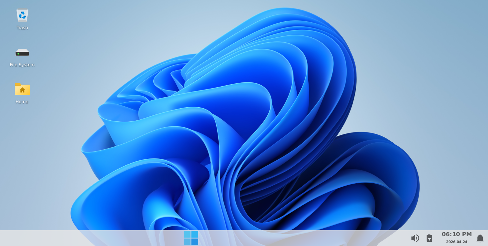
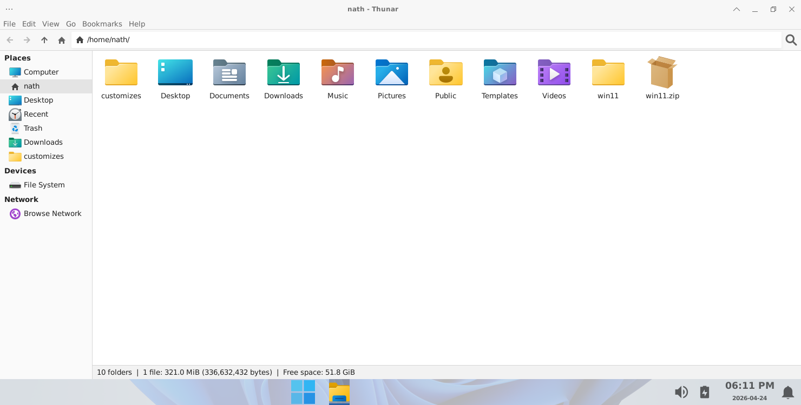
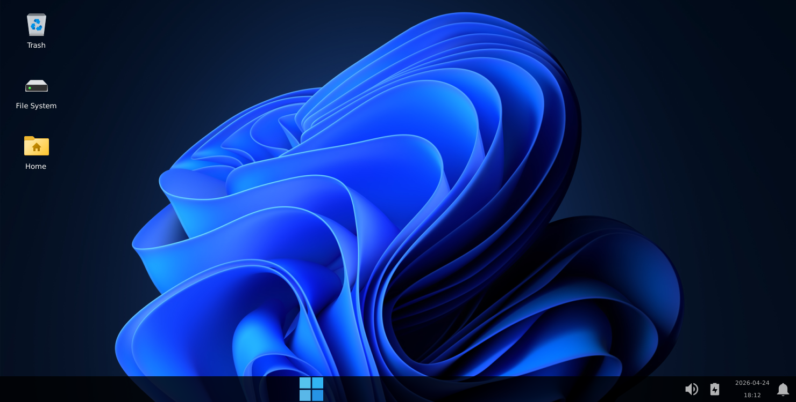
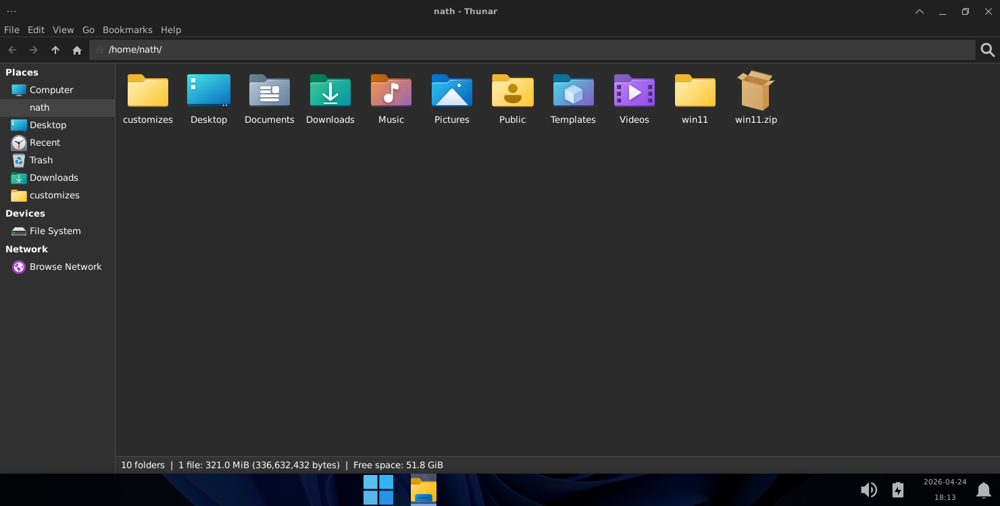

# How to make XFCE look like Windows
<p>customize your xfce look like window 11</p>

### Images

- <b>Win11 : Light</b>

*DESKTOP*
<p align="center"></p>

<br>

*FILEMANAGER*
<p align="center"></p>

<br>
<br>

- <b>Win11 : Light</b>

*DESKTOP*

<p align="center"></p>

<br>

*FILEMANAGER*

<p align="center"></p>

<br>
<br>


## yaha se aap apne xfce Desktop Ko Windows 11 ki tahar customize kar sakte ho
***Customize karne ke liye niche ke steps follow kare***

1. File ko extract karne ke liye plugins install kare (agar install nahi hai )
   
   ```bash
   sudo apt update
   ```

   ```bash
   sudo apt install thunar-archive-plugin file-roller -y
   ```

2. Docklike taskbar install kare

      ```bash
      sudo add-apt-repository ppa:xubuntu-dev/extras
      ```

      ```bash
      sudo apt update
      ```

      ```bash
      sudo apt install xfce4-docklike-plugin -y
      ```

3. Niche <b>Releases</b> me jao or Win11.zip file (321 MB ka) download kar lo

    - [Releases (Win11.zip)](https://github.com/sahu-dev-hub/xfce_customize/releases/tag/v1.0.0)
  
   ****Agar aap bilkul Beginner hai to SAHU DEV-HUB Youtube chanel visite Kar sakte hai****
      
    - [SAHU DEV_HUB]()


<br>

<br>

<br>

<br>


- ***Buy me a coffee🫠?*** 👇
 
   <details></br>
   <summary><b>Fuel my late-night coding sessions ☕</b></summary>
   <p align="center"></p>
   </details>

<br>
<br>
<br>

## Credits

* [SAHU DEV-HUB](https://github.com/sahu-dev-hub/)
* [Gtk-Theme](https://github.com/vinceliuice/Fluent-gtk-theme/)
* [icon-Theme](https://github.com/luisrguerra/fluent11-icon-theme/)
